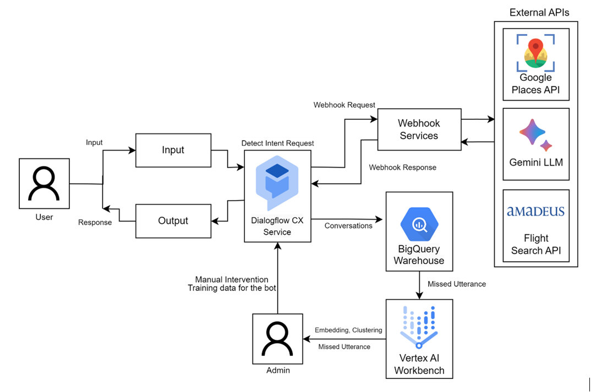

# Flight Booking Conversational Chatbot

An AI-powered conversational chatbot for flight booking and customer assistance built using **Google Cloud Platform** and **Dialogflow CX**.  

The chatbot integrates multiple cloud services, external APIs, and Large Language Models (LLMs) to provide intelligent conversational experiences for users while also improving chatbot performance through **missed utterance detection and analysis**.

## Demo Video

---

# Project Overview

The primary objective of this project is to build an intelligent **flight booking conversational assistant** capable of:
- understanding natural language queries,
- assisting users with flight-related interactions,
- integrating external APIs for real-time services,
- and continuously improving itself using conversational analytics.

The chatbot is developed using:
- **Dialogflow CX** for conversational flow management,
- **Google Cloud Functions** as webhook services,
- **Gemini LLM** for intelligent response generation,
- and **BigQuery + ML techniques** for missed utterance analysis.

---

# System Architecture

---

# How the System Works

## Conversational Workflow

1. User interacts with the chatbot
2. Dialogflow CX detects the intent
3. Dialogflow CX triggers Google Cloud Functions via webhooks
4. Cloud Functions process the request logic
5. External APIs and services are called when needed
6. Gemini LLM generates intelligent conversational responses
7. Processed response is returned back to Dialogflow CX
8. Final response is shown to the user

---

# Google Cloud Components Used

- Dialogflow CX
- Google Cloud Functions
- BigQuery
- Vertex AI Workbench
- Google Places API

---

# Chatbot Features

- Flight booking conversational assistant
- Natural language interaction
- Gemini 1.5 Flash LLM integration
- Dialogflow CX webhook integration
- Google Cloud-based architecture
- Google Places API integration
- Flight search integration
- Conversation logging and analytics
- Missed utterance detection system

---

# Missed Utterance Detection System

Along with the chatbot system, the project also includes a **Missed Utterance Detection and Analysis Pipeline**.

This module helps improve chatbot performance by identifying conversations where the chatbot fails to correctly understand user intent.

---

## Missed Utterance Workflow

1. User conversations are stored in BigQuery
2. Failed or unresolved utterances are extracted
3. Text embeddings are generated
4. Embeddings are reduced to 2D using t-SNE
5. K-Means clustering identifies conversational patterns
6. New intents and training phrases are discovered

This allows the chatbot to continuously evolve and improve over time.

---

# Tech Stack

## Conversational AI
- Dialogflow CX
- Gemini 1.5 Flash

## Cloud Platform
- Google Cloud Platform (GCP)
- Google Cloud Functions
- BigQuery
- Vertex AI Workbench

## Backend
- Python

## Machine Learning
- Text Embeddings
- t-SNE Dimensionality Reduction
- K-Means Clustering

## APIs
- Google Places API
- Amadeus Flight Search API

---

# Business Benefits

- Improve chatbot understanding accuracy
- Reduce unresolved user queries
- Minimize manual customer support intervention
- Enhance customer satisfaction
- Discover hidden conversational trends
- Improve overall chatbot efficiency

---

# License

This project is intended for educational and research purposes.